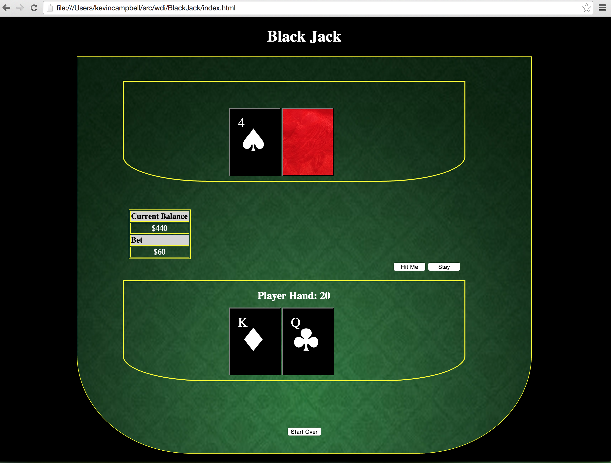

##Black Jack
[Black Jack Game](http://keji96.github.io/BlackJack/)
###Game Objectives
- The aim of the game is to accumulate a higher point total than the dealer, but without going over 21. You compute your score by adding the values of your individual cards.

- The cards 2 through 10 have their face value, J, Q, and K are worth 10 points each, and the Ace is worth either 1 or 11 points (player's choice).

###Game Play
- The hand begins when the player clicks the 'Deal Cards' button. The player will be prompted to enter a bet amount. The dealer will deal two cards to himself and the player. One of the dealers cards will be face down.

- After the initial deal the player can continue to take cards, a hit, by click the hit me button.

- The player can stand with his current hand by clicking the 'Stay' button. This will lead to the dealer revealing his hole card. The dealer will then continue to take hits while the value if his hand is less than 17.

- At that point the dealer will compare his hand to the players. If the player wins, his balance will be increased by the bet amount. If he loses his balance will decrease by the value of his bet.

- The player can start a new hand by clicking the 'Deal Cards' button.

- The player can restart the game at any time by hitting the 'Start Over' button.

##Screen-Shot
Inline-style:

##Technologies
- **HTML**
- **CSS**
- **JavaScript**
- **jQuery**

##UserStory
- As a user I would like to keep track of my bankroll so that I can know how much cash I have won.

- As a user I would like to place bets so that I can increase my bankroll

- As a user I would like to be dealt two cards at first so that I can make bets and decide weather to take a hit or to stay.

- As a user I would like to get more cards or stop getting cards at my choosing so that I can win my bet and increase my bankroll.

- As a user I would like to see one of the dealers cards so that I can compare it to my hand and make a decision on whether to hit or stay.

- As a user I would like to know when I bust so that I can i know when i have lost the hand.

- As a user I would like to know when I have won or tied a hand so that I can feel the thrill of winning or the meh of tying.

- As a user I would like the dealer to have a known hitting/stayng pattern so that I can establish my own game strategy.
